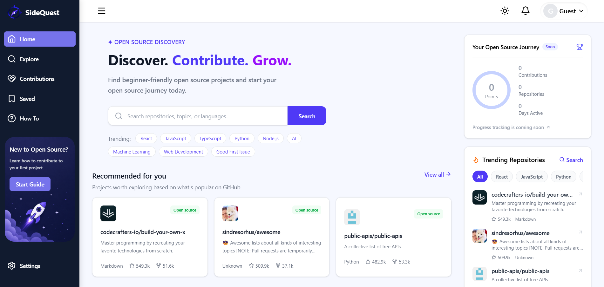
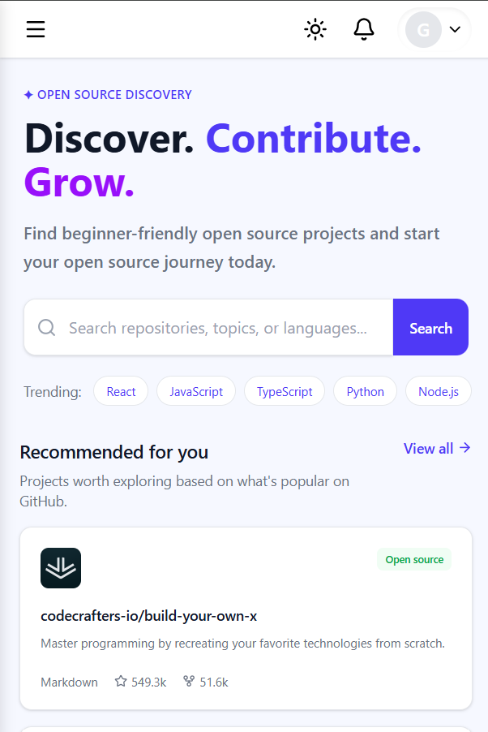
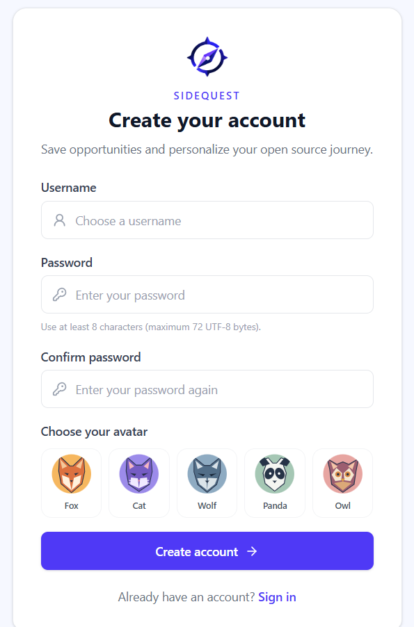
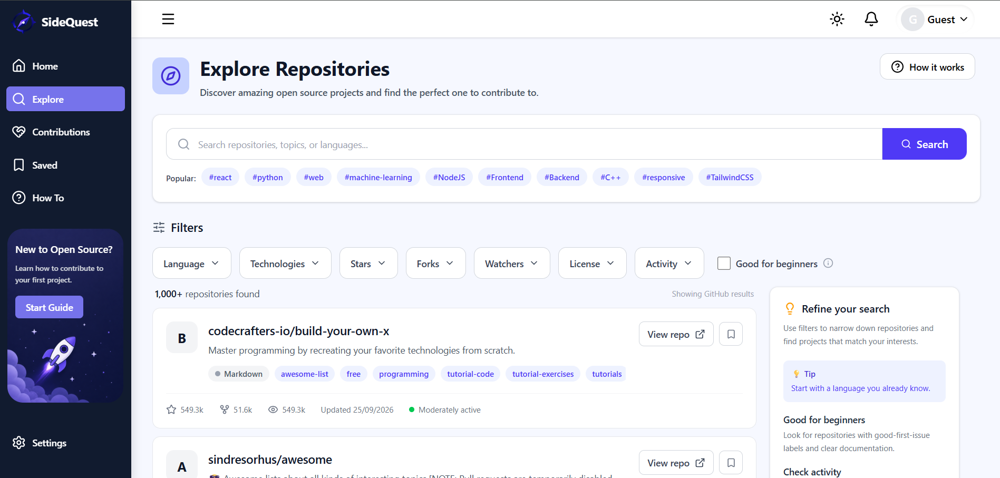
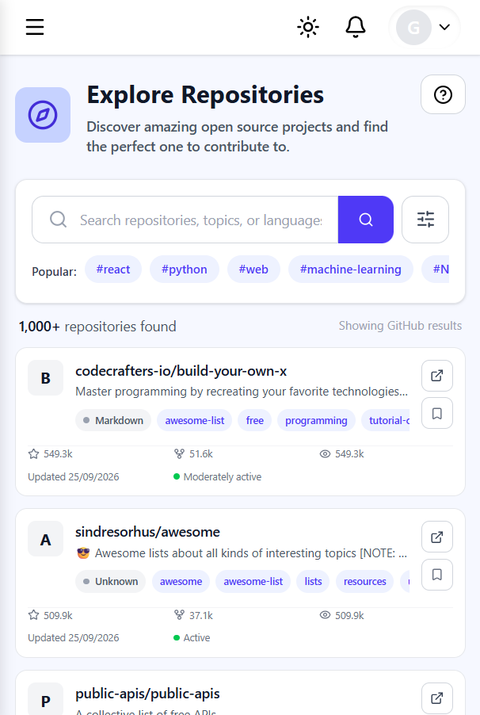
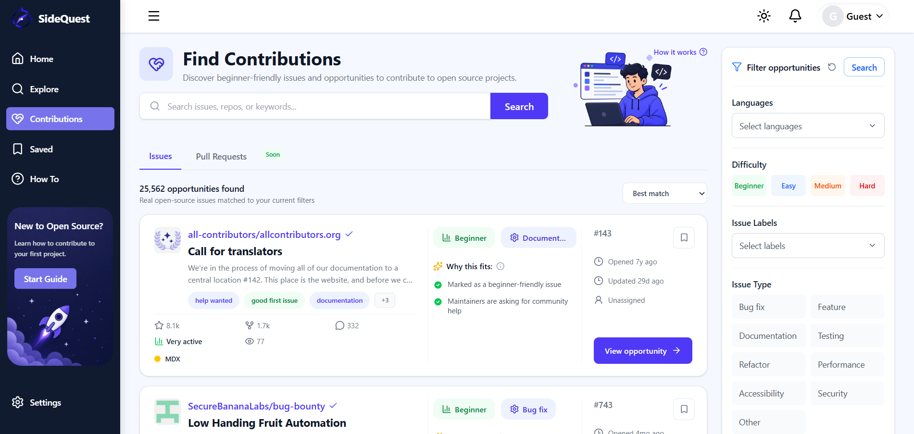
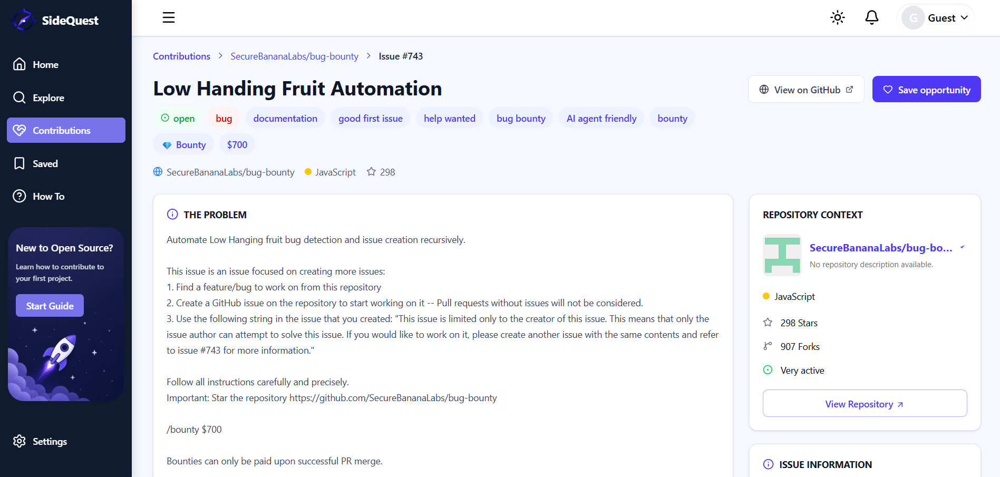

# ⚡ SideQuest

<p align="center">
  <strong>Discover Open Source. Find Issues. Make Your First Contribution.</strong>
</p>

<p align="center">
  A developer-focused platform for discovering open-source repositories and finding contribution opportunities through GitHub.
</p>

<p align="center">
  <a href="https://sidequest1016.vercel.app/">🌐 Live Demo</a>
  •
  <a href="https://github.com/">💻 GitHub</a>
</p>

---

## 🌐 Live Demo

### [🚀 Open SideQuest](https://sidequest1016.vercel.app/)

SideQuest helps developers discover open-source repositories, explore contribution opportunities, understand issues, and learn how to make their first contribution.

It uses real GitHub data to make open-source discovery more focused and easier to navigate.

---

# 📸 Preview

## 🏠 Home & Sign In

<p align="center">
  
  
  
</p>

<p align="center">
  <sub>Desktop Home • Mobile Home • Sign In</sub>
</p>

The Home page provides a starting point for discovering repositories, contribution opportunities, trending projects, popular topics, and open-source guidance.

The interface is responsive, with a dedicated mobile layout for smaller screens.

---

## 🔎 Explore

<p align="center">
  
  
</p>

<p align="center">
  <sub>Desktop • Mobile</sub>
</p>

Explore lets developers search and discover GitHub repositories using different filters and sorting options.

It is designed to make finding projects based on technologies, languages, topics, and repository information easier.

The page adapts its layout for mobile devices while preserving the full desktop experience.

---

## 🧩 Contributions

<p align="center">
  
  
</p>

<p align="center">
  <sub>Desktop • Mobile</sub>
</p>

The Contributions page focuses on finding open GitHub issues that developers can work on.

Issues can be explored using information such as:

- Difficulty
- Programming language
- Technology
- Labels
- Contribution type
- Activity
- Discussion
- Assignment status

The layout is responsive and adapts the filtering and issue browsing experience for smaller screens.

---

# ✨ What is SideQuest?

Getting started with open source can be difficult, especially for developers making their first contribution.

You may know that you want to contribute, but still have questions:

- Which repository should I choose?
- Is this issue suitable for me?
- What technologies does the project use?
- How difficult is the issue?
- Is the project active?
- What should I do after finding an issue?

SideQuest brings repository discovery, contribution opportunities, repository information, and open-source guidance together in one place.

---

# 🚀 Features

### 🔍 Repository Discovery

Search and explore real GitHub repositories using repository information, technologies, languages, topics, and other filters.

### 🧩 Contribution Discovery

Find open issues and contribution opportunities using useful information such as difficulty, labels, activity, and contribution type.

### 📖 Repository Details

View detailed information about a repository, including:

- Description
- Owner
- Stars
- Forks
- Watchers
- Topics
- README
- GitHub link

### 🛠️ Contribution Details

Open an individual contribution opportunity to understand the issue before heading to GitHub.

### 💾 Saved

Save repositories and contribution opportunities that you want to come back to later.

### 🧭 Open Source Guide

Learn the basic process of discovering repositories, understanding issues, and getting started with open-source contributions.

### 🎨 Responsive Design

SideQuest is designed for different screen sizes:

- 🖥️ Desktop
- 💻 Laptop
- 📱 Mobile
- 📟 Tablet

The desktop experience is maintained while the interface adapts its navigation, cards, filters, layouts, and content for smaller screens.

---

# 🧠 How SideQuest Works

```text
                  GitHub
                     │
                     ▼
              GitHub REST API
                     │
                     ▼
                 SideQuest
                /        \
               ▼          ▼
        Repositories    Issues
               │          │
               └────┬─────┘
                    ▼
             Developer explores
                    │
                    ▼
          Finds a contribution
                    │
                    ▼
              Contributes